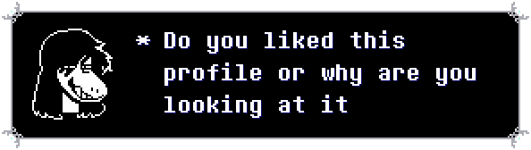

# SkeuoKitty

She / her / Pansexual / I luv mah dragon / a newbie programmer that likes technology a lot, likes to create videogame-related stuff, also I like emulation and 3D and 2D digital art in general not only furry art and retro stuff (i use a fallout terminal in linux named cool retro term)

<code>sudo echo i love cats</code>

### Main OS(es):
 and  
### Main Linux Distro (s):

### Languages:

# Current OC Design:

